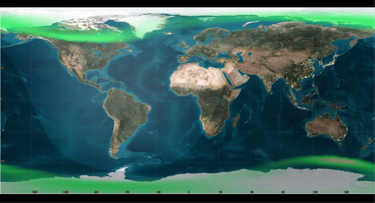

# aurora
:stars: Visualizations for NOAA's Space Weather forecast of auroras.

## Rationale
From Atlantic article What Happens When GPS Fails, June 13th 2016:
>On July 23, 2012, a billion-ton cloud of electrified gases blasted off the far side of the sun at over six million miles per hour. According to professor Daniel Baker at University of Colorado, this coronal mass ejection (CME) "was in all respects at least as strong as the 1859 Carrington Event," referring to the strongest solar storm ever recorded, which set fire to telegraph stations and caused auroras down to Cuba. As was widely reported two years ago, if the 2012 CME had occurred one week later, it would have hit Earth.

>Space Katrina would be biblically catastrophic. Power could be out for years while electrical transformers were repaired, if the resources are even available to do so. "Collateral effects of a longer-term outage would likely include disruption of the transportation, communication, banking, and finance systems, and government services; the breakdown of the distribution of potable water owing to pump failure; and the loss of perishable foods and medications because of lack of refrigeration,” reads a 2008 National Academy of Sciences report.

Satellite operations care deeply about the impacts of ionised particles hitting the Earth's atmosphere, as it can affect satellite performance &mdash; and regularly does!

## Notebooks
This notebook series was written during my assignment at the Canadian Space Agency in 2017, and got refactored in a private repository running on a looped closed-circuit TV rig. For all I know, it's still being used! =)

The [main notebook is found here](notebooks/space_weather_tools.ipynb).
